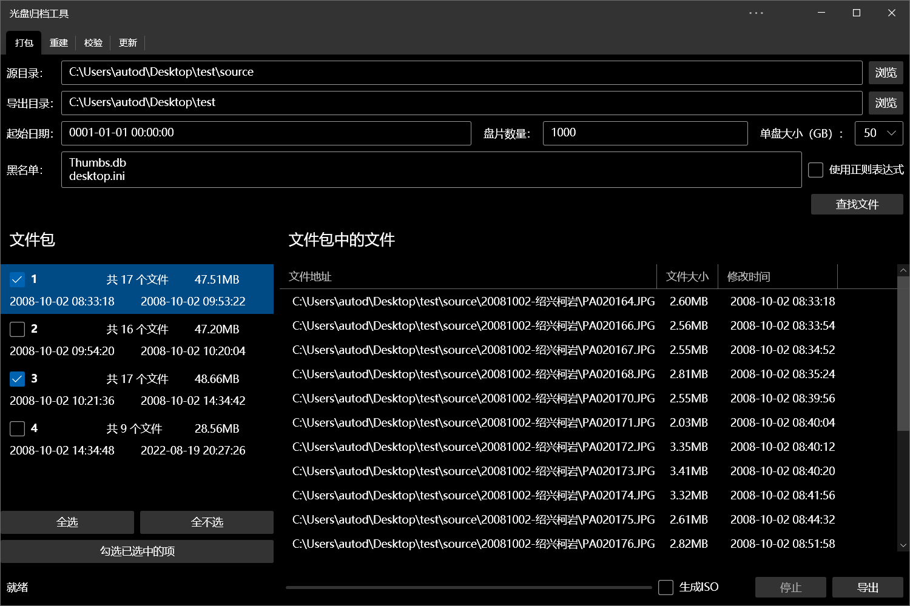

# 光盘存档工具

将一个持续更新目录中的文件，按从旧到新的时间顺序，分装到多个光盘中，实现备份功能。

## 为谁开发？

- 如果你需要将文件备份到光盘（等不可擦除的存储介质）中
- 如果你的文件在多个子目录中都会随着时间不断增加
- 如果你的大多数文件不会重复编辑，拥有固定的修改日期
- 如果你的单个文件大小远小于目标光盘的容量

## 能干什么？

- 将文件被分到光盘中
  - 将目录中的文件分割成若干部分，每部分的大小不超过一个光盘的容量
  - 按从旧到新的时间顺序排序，而不是按目录，这可以让新的数据无需插入到旧的光盘中
  - 平铺所有文件，恢复时能够重建目录结构
  - 支持根据时间，备份任意修改时刻后的文件，实现接续导出
- 重建
  - 将光盘中的文件重新复制到源文件所在的相对位置，实现目录的重新建立
- 校验
  - 支持进行文件元数据和MD5完整性验证
- 更新
  - 能够通过更新“文件列表”（文本文件）的方式，实现源目录中的文件调整后同步到光盘中

## 截图

## 日志

### 20220809

搭建基本框架，完成基本的导出功能

### 20220810

新增导出文件出错时支持重试、跳过、中断

新增支持停止

优化文件包列表的样式，支持右键复制时间

增加了运行时的IsEnable调整

预留了其他功能面板

### 20220811

新增黑名单功能

新增导出ISO功能

新增重建分析，使用树状图显示原始目录结构

新增重建目录功能，基本完成重建页面

### 20220812

新增未捕获错误处理

新增支持仅导出勾选的文件包

修复了打包和重建时文件修改时间错误的BUG

支持了多个输入目录的重建

修复了打包出现问题时的对话框的BUG

新增打包和重建时的进度条

支持的参数配置的记忆功能

基本完成校验部分

### 20220813

打包界面新增方便的文件包选择按钮

### 20220814

优化了ISO导出

新增了重建时的覆盖设置和错误报告

### 20220819

完成了更新面板中的检查功能

### 20220820

完成更新功能

修复了因为修改时间精度问题导致校验不通过的BUG

新增重建和校验界面的停止按钮